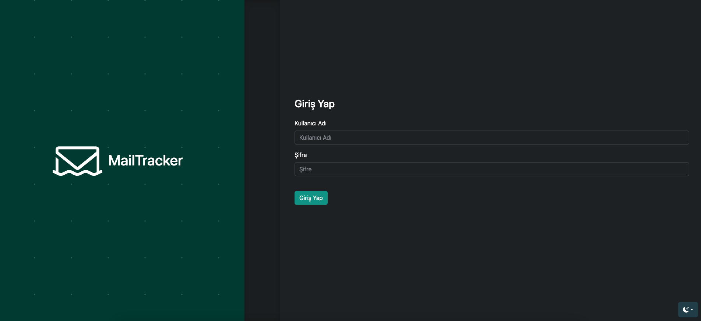
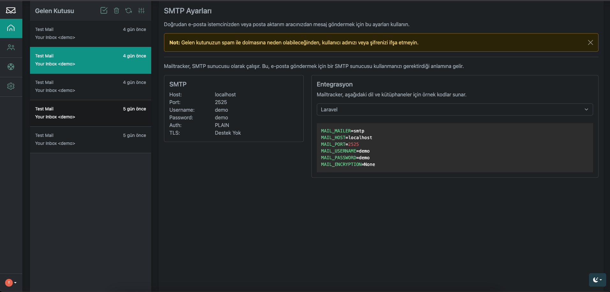
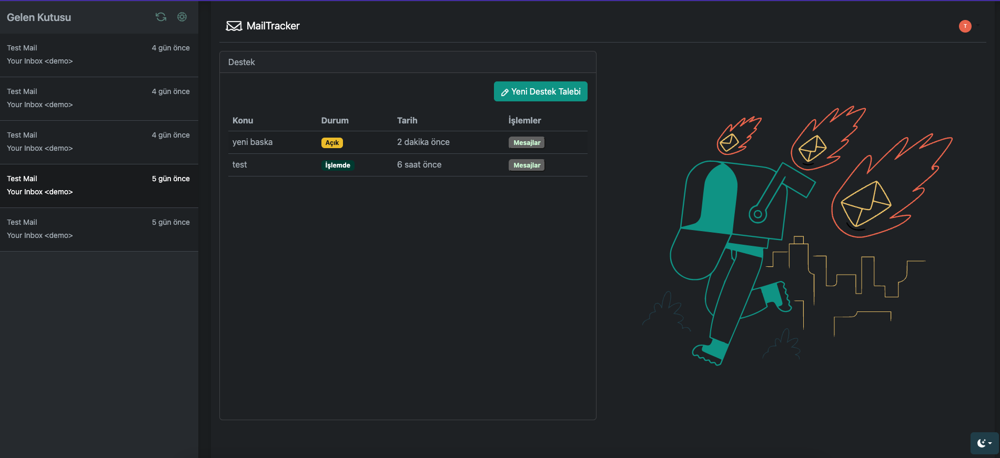

# MailTracker

MailTracker is an invaluable tool for developers and teams involved in email testing and development. It provides a virtual environment where you can test your emails without disturbing real mailboxes. With MailTracker, you can capture real emails, perform debugging, and ensure that your email integrations work seamlessly. It eliminates the risk of accidentally sending emails to real customers during the development process. By using MailTracker, developers can easily identify and fix issues, validate email delivery, and ensure the proper appearance of emails. Whether you're working on a small project or a large-scale application, MailTracker simplifies the process of testing and debugging email functionalities, making it an essential tool for any development workflow.


login


dashboard admin


dashboard watcher


#### Running

For SMTP server
```bash
go run main.go
```

For Api server
```bash
go run main.go api
```

#### Testing

```curl
curl  \
--url 'smtp://localhost:2525' \
--user 'demo:demo' \
--mail-from from@example.com \
--mail-rcpt rcpt@example.com \
--upload-file - <<EOF
From: My Inbox <from@example.com>
To: Your Inbox <to@example.com>
Subject: Test Mail
Content-Type: multipart/alternative; boundary="boundary-string"

--boundary-string
Content-Type: text/plain; charset="utf-8"
Content-Transfer-Encoding: quoted-printable
Content-Disposition: inline

Test Mail

Lorem Ipsum is simply dummy text of the printing and typesetting industry. Lorem Ipsum has been the industry's standard dummy text ever since the 1500s, when an unknown printer took a galley of type and scrambled it to make a type specimen book

--boundary-string
Content-Type: text/html; charset="utf-8"
Content-Transfer-Encoding: quoted-printable
Content-Disposition: inline

<!doctype html>
<html>
  <head>
    <meta http-equiv="Content-Type" content="text/html; charset=UTF-8">
  </head>
  <body style="font-family: sans-serif;">
    <div style="display: block; margin: auto; max-width: 600px;" class="main">
      <h1 style="font-size: 18px; font-weight: bold; margin-top: 20px">Test Mail</h1>
      <p>Lorem Ipsum is simply dummy text of the printing and typesetting industry. Lorem Ipsum has been the industry's standard dummy text ever since the 1500s, when an unknown printer took a galley of type and scrambled it to make a type specimen book</p>
    </div>
    <style>
      .main { background-color: #EEE; }
      a:hover { border-left-width: 1em; min-height: 2em; }
    </style>
  </body>
</html>

--boundary-string--
EOF
```

#### Features

* SMTP Authentication
* Webhook Discovery
* Api
