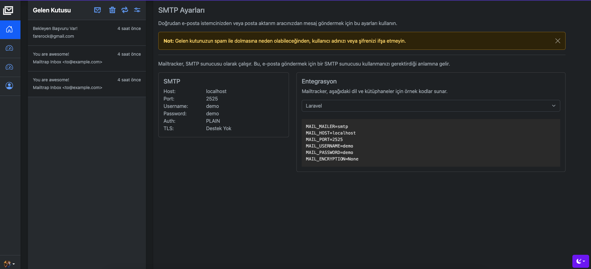

# MailTracker



#### Testing

```
$ telnet localhost 1025
```

```
EHLO localhost
AUTH PLAIN
AHVzZXJuYW1lAHBhc3N3b3Jk
MAIL FROM:<test@test.com>
RCPT TO:<smtp@alert.karenplankton>
DATA
Hey
.
```

```curl
curl  \
--url 'smtp://localhost:2525' \
--user 'demo:demo' \
--mail-from from@example.com \
--mail-rcpt to@example.com \
--upload-file - <<EOF
From: Magic Elves <from@example.com>
To: Mailtrap Inbox <to@example.com>
Subject: You are awesome!
Content-Type: multipart/alternative; boundary="boundary-string"

--boundary-string
Content-Type: text/plain; charset="utf-8"
Content-Transfer-Encoding: quoted-printable
Content-Disposition: inline

Congrats for sending test email with Mailtrap!

Inspect it using the tabs above and learn how this email can be improved.
Now send your email using our fake SMTP server and integration of your choice!

Good luck! Hope it works.

--boundary-string
Content-Type: text/html; charset="utf-8"
Content-Transfer-Encoding: quoted-printable
Content-Disposition: inline

<!doctype html>
<html>
  <head>
    <meta http-equiv="Content-Type" content="text/html; charset=UTF-8">
  </head>
  <body style="font-family: sans-serif;">
    <div style="display: block; margin: auto; max-width: 600px;" class="main">
      <h1 style="font-size: 18px; font-weight: bold; margin-top: 20px">Congrats for sending test email with Mailtrap!</h1>
      <p>Inspect it using the tabs you see above and learn how this email can be improved.</p>
      
      <p>Now send your email using our fake SMTP server and integration of your choice!</p>
      <p>Good luck! Hope it works.</p>
    </div>
    <!-- Example of invalid for email html/css, will be detected by Mailtrap: -->
    <style>
      .main { background-color: white; }
      a:hover { border-left-width: 1em; min-height: 2em; }
    </style>
  </body>
</html>

--boundary-string--
EOF
```

## Features

* SMTP Authentication
* Webhook Discovery
* Api